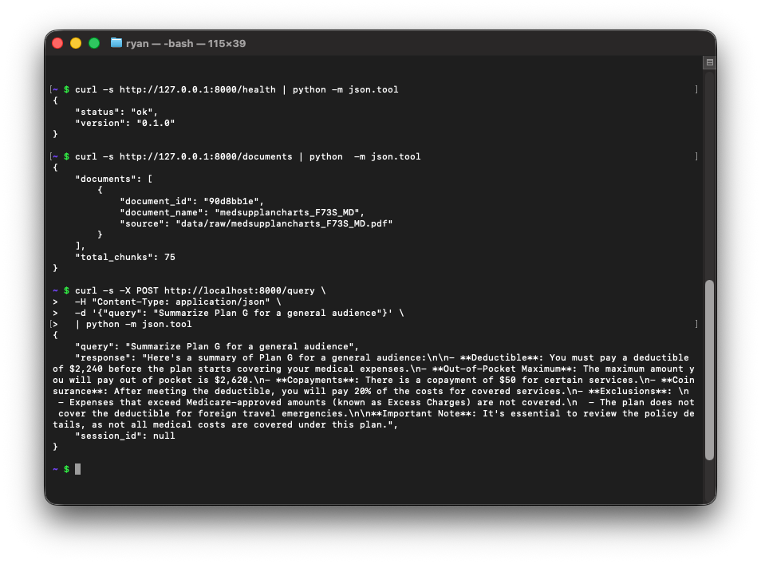
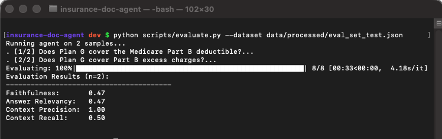

# Insurance Document Intelligence Agent

An agentic AI system that ingests insurance policy documents, extracts structured
information, answers coverage questions, detects anomalies, and generates plain-language
summaries — powered by an LLM with tool use and retrieval-augmented generation (RAG).

---

## Architecture

```
insurance-doc-agent/
├── ingestion/          # Document parsing and chunking
├── embeddings/         # Vector store and retrieval
├── agent/              # LLM agent with tool orchestration
├── tools/              # Individual tool implementations
├── api/                # FastAPI serving layer
├── evaluation/         # Output quality metrics (RAGAS)
├── notebooks/          # Exploratory demos
├── data/
│   ├── raw/            # Source PDF documents (gitignored)
│   └── processed/      # Chunked and embedded outputs (gitignored)
├── tests/              # Unit and integration tests
└── scripts/            # Utility scripts (ingest, evaluate, etc.)
```

## Core Capabilities

| Tool | Description |
|------|-------------|
| `search_policy_document` | RAG retrieval over ingested documents |
| `extract_coverage_limits` | Structured extraction of coverage amounts and limits |
| `compare_policies` | Multi-document reasoning and comparison |
| `flag_anomalies` | Rule-based and LLM anomaly detection |
| `generate_summary` | Plain-language summaries for different audiences |

## Quick Start

### Prerequisites

- Python 3.10+
- OpenAI API key

### Installation

```bash
git clone https://github.com/rydcormier/insurance-doc-agent
cd insurance-doc-agent

python -m venv .venv
source .venv/bin/activate  # Windows: .venv\Scripts\activate

pip install -r requirements.txt
```

### Configuration

```bash
cp .env.example .env
# Edit .env with your API keys and settings
```

### Ingest a Document

```bash
python scripts/ingest.py --file data/raw/your_policy.pdf
```

### Run the Agent

```python
from agent.agent import InsuranceAgent

agent = InsuranceAgent()
response = agent.run("What is the deductible on this policy?")
print(response)
```

### Start the API

```bash
uvicorn api.app:app --reload --port 8000
```



### Run Evaluations

```bash
python scripts/evaluate.py --dataset data/processed/eval_set.json
```

Runs four RAGAS metrics — faithfulness, answer relevancy, context precision, and context
recall — against agent outputs. The evaluator uses `gpt-4o-mini` as the judge LLM and
`text-embedding-3-small` for answer-relevancy scoring (requires a valid `OPENAI_API_KEY`).



## Evaluation Results

Benchmarked against a 20-question dataset derived from the Florida OIR Medicare Supplement
Outline of Coverage (Form OIR-B2-MSC2), covering all 10 standard plans. Evaluated using
RAGAS with `gpt-4o-mini` as judge LLM. Benchmark available at
`data/processed/eval_set_medsuppl.json`.

### Parameter Study — chunk_size / chunk_overlap

| Metric | v1 (1000 / 200) | v2 (800 / 300) |
|--------|-----------------|----------------|
| Faithfulness | 0.71 | 0.69 |
| Answer Relevancy | 0.83 | 0.81 |
| Context Precision | 0.82 | **0.87 ↑** |
| Context Recall | 0.54 | **0.58 ↑** |

Smaller chunks with higher overlap improved retrieval precision and recall at a measured
cost to faithfulness — a tradeoff reflecting the tabular structure of insurance policy
documents, where reducing chunk size improves boundary precision but reduces the context
available to ground each answer. Next experiment: plan-aware chunking using Medicare
Supplement plan section headers as natural boundaries.

## Tech Stack

| Layer | Technology |
|-------|------------|
| LLM | OpenAI GPT-4o / gpt-4o-mini |
| Agent Framework | LangChain |
| Embeddings | OpenAI text-embedding-3-small |
| Vector Store | ChromaDB |
| Document Parsing | pdfplumber |
| Structured Output | Pydantic + instructor |
| Evaluation | RAGAS |
| API | FastAPI |
| Testing | pytest |

## Roadmap

- [x] Project scaffold
- [x] Document ingestion pipeline
- [x] Embedding and vector store
- [x] RAG retrieval tool
- [x] Structured extraction tool
- [x] Policy comparison tool
- [x] Anomaly detection tool
- [x] Summary generation tool
- [x] Agent orchestration
- [x] FastAPI serving layer
- [x] RAGAS evaluation framework
- [ ] Demo notebook
- [ ] Plan-aware chunking strategy
- [ ] Improve context recall above 0.65

## References

- [LangChain Documentation](https://python.langchain.com/)
- [RAGAS Evaluation Framework](https://docs.ragas.io/)
- [ChromaDB Documentation](https://docs.trychroma.com/)
- [instructor library](https://python.useinstructor.com/)
